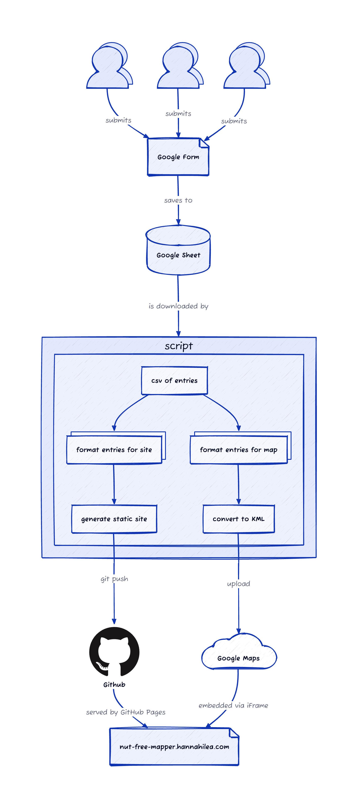

_**WIP - Actively under construction!**_

# Nut allergy handbook! 

Mapping the current state of nut-allergy-friendliness of various restaurants, coffee shops, and other venues. 

🥳 **View site: [https://hannahilea.com/nut-allergy-handbook](https://hannahilea.com/nut-allergy-handbook)** 🥳

## Site generation workflow

## Punch list
- [x] create map shell: https://www.google.com/maps/d/u/0/edit?mid=1ByVtx0dsYJ8E_suvTlCRM363DHYZ6Io&ll=42.38269187688064%2C-71.09720596296654&z=15
- [x] google form
- [x] change visibility of site to public
- [x] set up github pages for site (not possible until public)
- [x] embed map in static site
- [x] generate static site from script
- [ ] add license
- [x] fill in script:
  - [x] download sheet csv 
  - [x] parse entries for website
  - [x] pull entries into website
  - [x] parse entries for map
  - [x] format entries as map format (KML??)
- [ ] figure out map upload; may be manual to start?
- [ ] add big ol' faq/disclaimer section/page about role of this info
- [ ] add links to tools used (e.g. css, google maps, etc)

### Feature creep future:
- Run script via GHA instead of manually
- Add filtering to table
- Multiple tables for various restaurant categories (safety, type, stars, etc)
- Handle different geographies (filters/pages/whatever); Add location to table (city or zipcode etc)?
- Template for contacting restaurants
- Figure out privacy issues of delayed updating of site, private version of site while traveling, etc
- Support multiple entries for the same venue (e.g. timestamped dates for updated menus, updated queries, etc)
- "hall of fame" for places that actively promote allergen friendliness AND that have moved from non-friendly to friendly
- Add (separate) workflow that supports nicer realtime site investigation (interop with Google Maps directly, etc)
- Figure out how to add tags for venue type (cafe/food/etc)
- Add separate page (?) for chain restaurants?
- Add extra handbook pages

## Fields for form 
- date contacted
- person contacting
- map link
- other (visible)
- other (private)
- safety class
- caveats 
- unsafe items

optional:
- link to menu

## Rebuild site for new map entries

Currently, this process is manual. In future, it will be automated. After new [map entries](https://forms.gle/qx1TQDyGLTcRK7NKA) are submitted:

1. Rebuild site from new entries: `julia --project=site-builder site-builder/run.jl --download`

2. Merge changes into the main branch to update the live site.

2. Update the map with the updated `map.kml` file:
  Manually:
    1. Go to [map](https://www.google.com/maps/d/u/0/edit?mid=1ByVtx0dsYJ8E_suvTlCRM363DHYZ6Io&ll=42.375241545463325%2C-71.11262795632939&z=14)
    2. Delete all existing layers from map
    3. Add new layer; import the `map.kml` file generated (/updated) by the site rebuild
  Semi-automated (requires being signed into google account in Safari):
    1. `automator clean-map.workflow` to delete existing layers
    2. Add new layer by dragging updated `map.kml` into now-opened browser window
