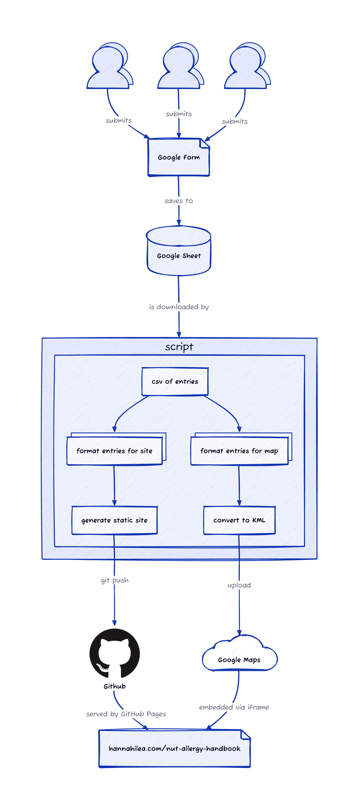

_**WIP - Actively under construction!**_

# Nut allergy handbook! 

Mapping the current state of nut-allergy-friendliness of various restaurants, coffee shops, and other venues. 

🥳 **View site: [https://hannahilea.com/nut-allergy-handbook](https://hannahilea.com/nut-allergy-handbook)** 🥳

## Site generation workflow

### Steps for rebuilding site and updating map with new entries

Currently, this process is manual. In future, it will be automated. After new [map entries](https://forms.gle/qx1TQDyGLTcRK7NKA) are submitted:

1. Rebuild site from new entries: `julia --project=site-builder site-builder/run.jl --download`

2. Merge changes into the main branch to update the live site.

2. Update the map with the updated `map.kml` file:
  Manually:
    1. Go to [map](https://www.google.com/maps/d/u/0/edit?mid=1ByVtx0dsYJ8E_suvTlCRM363DHYZ6Io&ll=42.375241545463325%2C-71.11262795632939&z=14)
    2. Delete all existing layers from map
    3. Add new layer; import the `map.kml` file generated (/updated) by the site rebuild
  Semi-automated (requires being signed into google account in Safari):
    1. `automator clean-map.workflow` to delete existing layers
    2. Add new layer by dragging updated `map.kml` into now-opened browser window

## Big list o' potential future features

Will any of these ever be added? Great question, we'll find out together.

### Dev/script:
- Run script via GHA instead of manually
- Support multiple entries for same venue (or just error if found/merge them)
- Figure out how to support context-specific allergen status changes
- Figure out how to get tags for venue type (cafe/food/etc) from place link, add to table
- Figure out nice workflow to supports realtime site investigation (interop with Google Maps directly? browser plugin/phone shortcut/something)
  - ...implement it!

### Site: 

Current landing page:
- Add filtering/sorting options to tables
- Handle different geographies (filters/pages/whatever); Add location to table (city or zipcode etc)?

Content on other pages:
- Add "about site" page
- Add contact info (for place submission; follow-up by existing places; "something has changed" info)
- Add "how we scan restaurants/what we ask about" info
- Add page with cuisine-specific info
- Add page for chain restaurants 
- Add template/info for contacting restaurants
- Add "hall of fame" for places that actively promote allergen friendliness AND that have moved from non-friendly to friendly?? + (geography-specific) rss feed for new safe venues??
  - ...stickers? :) 
- Add resources page

## Attributions

- Favicon logo: Warning by Studio 365 from <a href="https://thenounproject.com/browse/icons/term/warning/" target="_blank" title="Warning Icons">Noun Project</a> (CC BY 3.0)
- CSS Styling: [almond.css](https://github.com/alvaromontoro/almond.css) (yes, I did intentionally choose this one because of the name(!))
